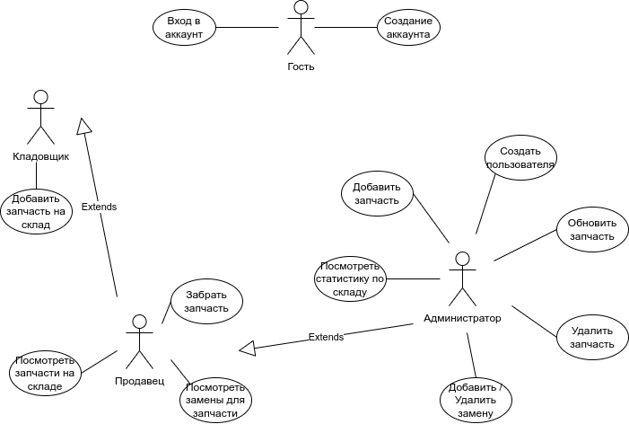
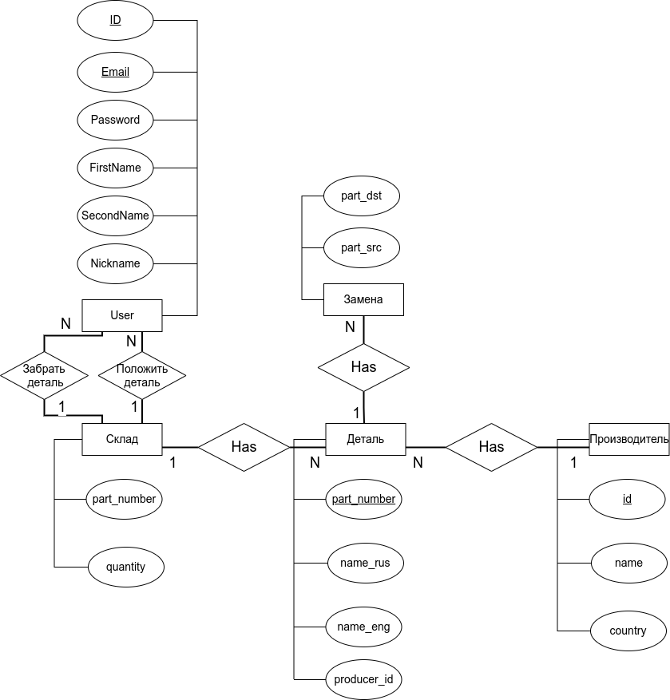

# Название проекта
## MyStock

# Краткое описание идеи проекта 
Сервис для работы со складом автозапчастей. Должна быть предусмотрена возможность добалвления, удаления и обновления деталей в общей базе с деталями, а также возможность следить за состоянием склада. Должно быть предусмотрено деление на пользователей по их возможностям работы со складом. Кладовщик может только добавить запчасть на склад, продавец может посмотреть какие запчасти на складе в данный момент и продать запчасть со склада, администратор может вдобавок посмотреть статистику по складу за все время.

# Краткое описание предметной область
Многие автосервисы заказывают запчасти у сторонних производителей и хранят их на своем складе. У каждой запчасти есть идентифицирующая ее строка -- артикул, название на русском и на английском языках. О пользователях известны их ФИО, номер телефона и права доступа:
 - продавец
 - кладовщик
 - администратор

# Краткий анализ аналогичных решений по 3 критериям

| Название приложения | добавление своих запчастей | замены для запчастей | разбиение пользователей |
|:-------------------:|:--------------------------:|:--------------------:|:-----------------------:|
| stoCRM | + | - | + |
| Splus | - | - | + |
| AutoИнтеллект | + | - | - |

# Краткое обоснование целесообразности и актуальности проекта

В настоящее время тяжело найти оригинальные автозапчасти, в то же время большинство имеет аналоги, на которые их можно заменить. Также в многие автосервисы не имеют какого-то ПО для проверки состояния и быстрого ответа на вопрос о наличии детали или ее аналогов.

# Use-Case - диаграмма

# ER-диаграмма сущностей

# UI

[UI в Figma](https://www.figma.com/file/vIa0dJ7KyxS4mEgKucmnyi/Inventory-Management-system-(Community)?node-id=0%3A1)