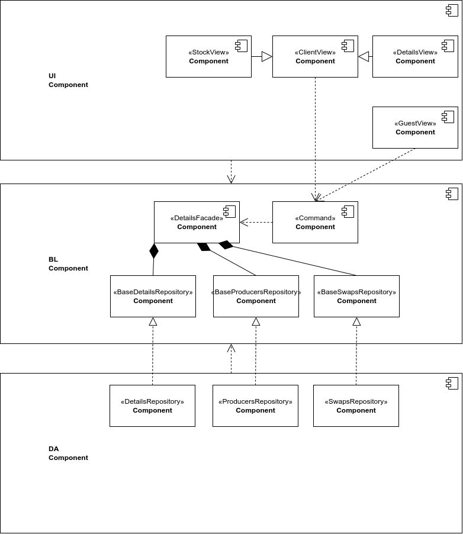
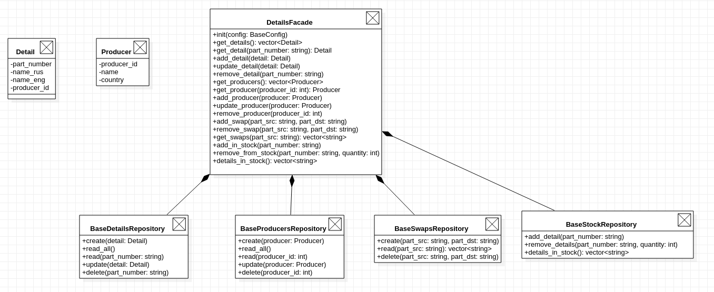
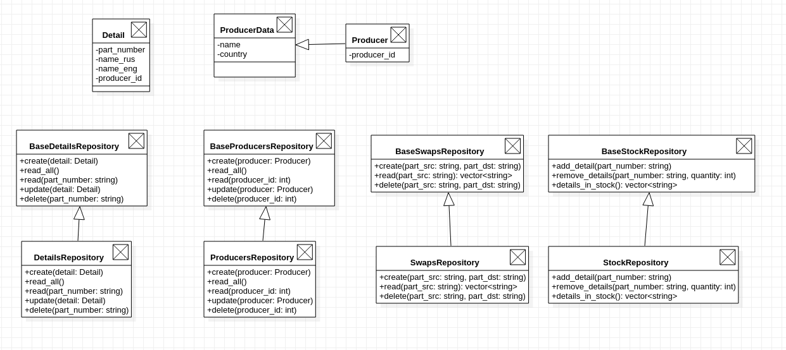

# Описание типа приложения и выбранного технологического стека

WEB приложение. Для соединения по сети используется библиотека boost::asio и корутины из 20 стандарта. Для парсинга http запросов используется boost::beast. Для обработки конфигов -- YAMLCPP, для json -- JSONCPP. В качестве СУБД используется PostgreSQL. Подключение к СУБД из кода приложения с использованием библиотеки libpqxx.

# Верхнеуровневое разбиение на компоненты

# UML диаграммы классов для двух отдельных компонентов - компонента доступа к данным и компонента с бизнес-логикой.

